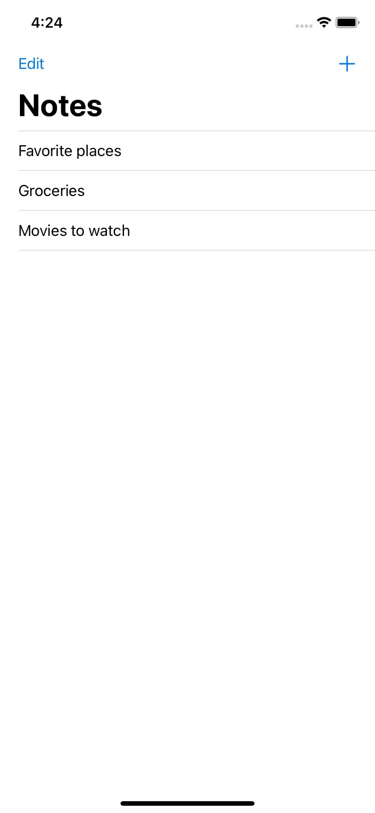
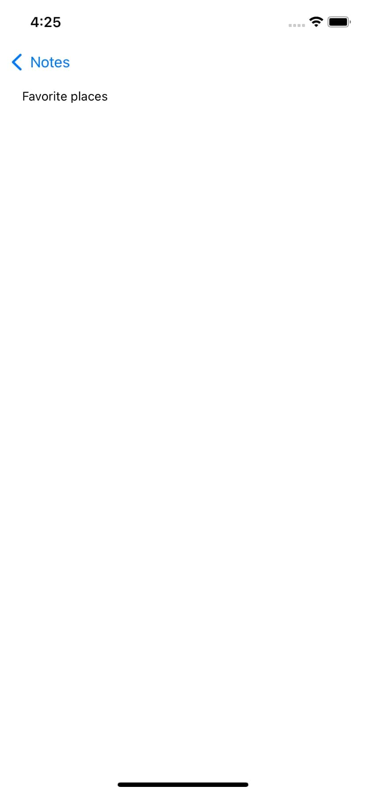
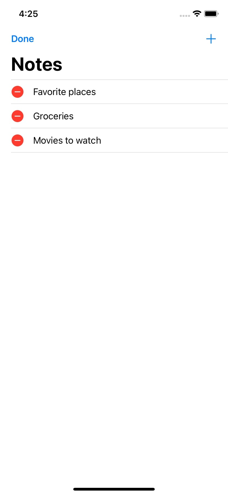

# Hack Technology / Project Attempted

Basic iOS notes app

## What you built? 

I followed a tutorial to make a basic notes app using Swift in Xcode. In the app, you can create notes, name notes, and delete notes. It also saves the notes upon closing the app.

Here is a screenshot of the main screen. You can add new notes with the "+" button and delete notes by pressing "Edit" or by sliding notes to the left.

This is what a note looks like once you press it. You can add text within the note by typing.

This is what the screen looks like in edit mode. You can delete a note by pressing the red button then selecting delete. You exit edit mode by pressing "Done."

## Who Did What?

I worked alone!

## What you learned

I learned the basics of swift as well as some of the features available in the Xcode IDE. I learned how to connect UI elements with the code and used the Xcode storyboard.

## Authors

Nick Schoeller
(The code I followed was written by Todd Perkins)

## Acknowledgments

* Notes app tutorial: https://www.linkedin.com/learning/building-a-note-taking-app-for-ios-11-with-swift/handle-table-view-row-deletions?u=2167153
* Intro to Swift: https://www.linkedin.com/learning/swift-5-essential-training/type-conversions?u=2167153

